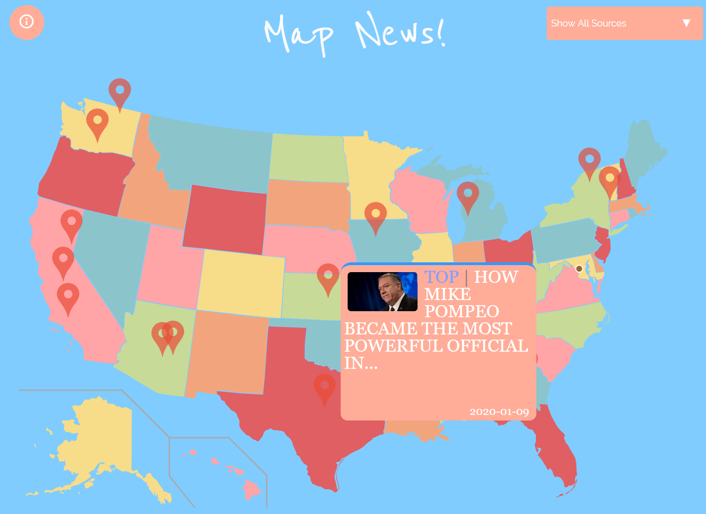

# map-news
Realtime web application built with HTML/CSS/Javascript, utilizing Socket.io and multiple news API's to deliver a centralized, visual representation of nationwide news. Built by Eric Jiang, Melina Muthuswamy, and Kevin Yan.

Our mission is to give you a unique way of interacting with news and help you stay in touch with what's going on in the US. In a nutshell, our site aggregates and displays top news stories and tweets from a variety of sources in real time.

## Usage
1. Open /index.html
2. In terminal/command prompt, run node server to enable websockets and api queries. User must have Node.js installed.
```
node /js/n.js
```
## Example


